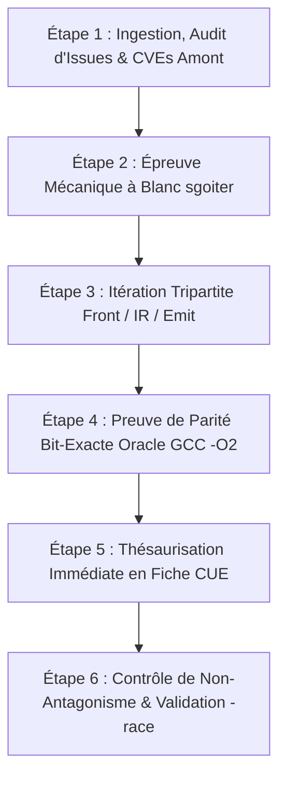

# Protocole Canonique de Dogfooding Sgoiter

> **Règle Fondatrice :** Le dogfooding de `sgoiter` n'est pas un simple test de compilation au coup par coup. C'est une discipline d'ingénierie itérative et systématique en **6 étapes obligatoires**, garantissant que toute anomalie ou cas limite devient une capacité logicielle permanente, bit-exacte et formellement thésaurisée en CUE.

---

## Les 6 Étapes Canoniques du Dogfooding

---

### Étape 1 — Ingestion, Audit d'Issues & CVEs Amont
- **Sélection de la Source C Réelle :** Ingestion du fichier source amont (`sources/x.c` ou `spec/c_sources/...`).
- **Recherche Bibliographique des Défaillances :** Extraction systématique des CVEs, rapports d'anomalies (*issues trackers*) et cas limites historiques de la bibliothèque (flottants subnormaux, corruption de pointeurs, endianness, injection d'octets nuls, récursion cyclique).
- **Définition de l'Oracle C :** Mise en place d'un binaire C compilé avec `gcc -O2` générant les Known Answer Tests (KATs).

### Étape 2 — Épreuve Mécanique à Blanc (`sgoiter -in -out`)
- **Exécution brute du transpileur :** `sgoiter -in source.c -out gen.go`.
- **Inventaire mécanique des blocages :** Relevé précis des fonctions ignorées (`skipped`), des échecs d'analyse (`err_parse`) et des stubs générés.
- **Interdiction Formelle :** Zéro contournement par écriture de fichiers Go manuscrits (`hand_*.go`).

### Étape 3 — Itération Tripartite Compilateur (`front` $\rightarrow$ `ir/rules` $\rightarrow$ `emit`)
- **Front (`sgoiter/front`) :** Extension de la grammaire C (typedefs, unions, structures imbriquées, alignements, switchs, initialisations partielles).
- **IR & Règles ARCHTIME (`sgoiter/rules`) :** Pliage statique à la compilation (tables constantes, déroulage de boucles, simplification booléenne).
- **Émetteur (`sgoiter/emit`) :** Typage chirurgical (scalaires vs tranches, arithmétique 128-bit via `math/bits`, sécurité des décalages, isolation des allocations).

### Étape 4 — Preuve Formelle de Parité Bit-Exacte (Oracle GCC `-O2`)
- **Harnais Comparatif :** Exécution de `Test*VsCOracle` comparant bit à bit la sortie du code Go transpilé et du code binaire C GCC.
- **Couverture Exhaustive :** Validation sur 100% des cas nominaux et des vecteurs de test issus des CVEs historiques.

### Étape 5 — Thésaurisation Immédiate en Schéma CUE (`spec/findings/`)
- **Règle Dure de Clôture d'Anomalie :** Tout cas limite résolu, tout bug corrigé ou toute règle introduite doit faire l'objet d'une fiche CUE `#Finding` (`F-sgoiter-<slug>.cue`) dans `sgoiter/spec/findings/`.
- **Validation Statique :** Exécution obligatoire de `cue vet sgoiter/spec/findings`.

### Étape 6 — Contrôle de Non-Antagonisme & Validation Système Globale
- **Régression Transverse :** Exécution de `go test -run TestEveryDogfoodSourceCompiles .` (100% des 38+ sources dogfood doivent compiler avec code 0).
- **Détection de Concurrence :** Exécution intégrale sous `GOEXPERIMENT=simd go test -race ./...`.
- **Revue Froide & Commit :** Validation mécanique via `/devhoros/horos55/bin/horos55-commit-guard pre-add` $\rightarrow$ `pre-commit` $\rightarrow$ `post-commit`.
